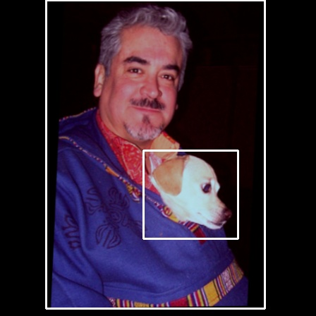

# Quick and easy to use VOCdataset


## Dataset
We define a class named VOCDetection, it can choose the data mode in the dataset at will.\
For example, if you make `image_sets=[('2007', 'trainval')]`, it means that the dataset is built on VOC2007/trianval.\
Also, you can make `image_sets=[('2007', 'trainval'), ('2012', 'trainval')]`, the dataset is VOC07+12.

## Data Augmentation
In `data_aug.py`, two classes are defined, DataAugmentation and BaseTransform. You can apply them to the train and val sessions respectively, and modify them to achieve different effects

## Examples
Modify your data root, and input the following code to see the effect of the implementation.
```
!python voc.py
```


## Reference
[https://github.com/Paperspace/DataAugmentationForObjectDetection](https://github.com/Paperspace/DataAugmentationForObjectDetection)
[https://github.com/fmassa/vision/blob/voc_dataset/torchvision/datasets/voc.py](https://github.com/fmassa/vision/blob/voc_dataset/torchvision/datasets/voc.py)
